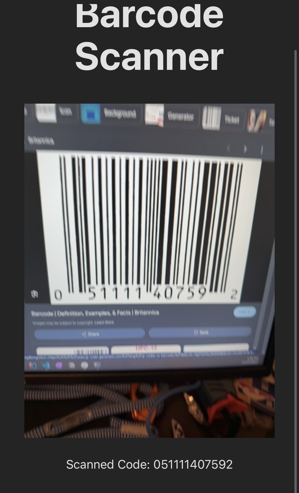

# Barcode Reader Demo (Also works on QR codes)

Proof of concept for reading barcodes from mobile device.
Using `react-qr-barcode-scanner`

### To run:
```
npm install
npm run dev
```

HTTPS is needed to access the camera on most mobile devices, so this generates its own SSL certificate. Your device may prompt you to manually trust the site due to this.

use `npm run dev -- --host` to host on your network and access from your mobile device.

or `npm run dev` to host locally like normal

Example of website

